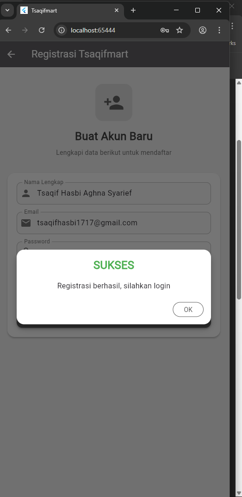
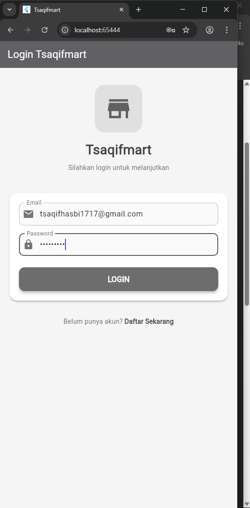
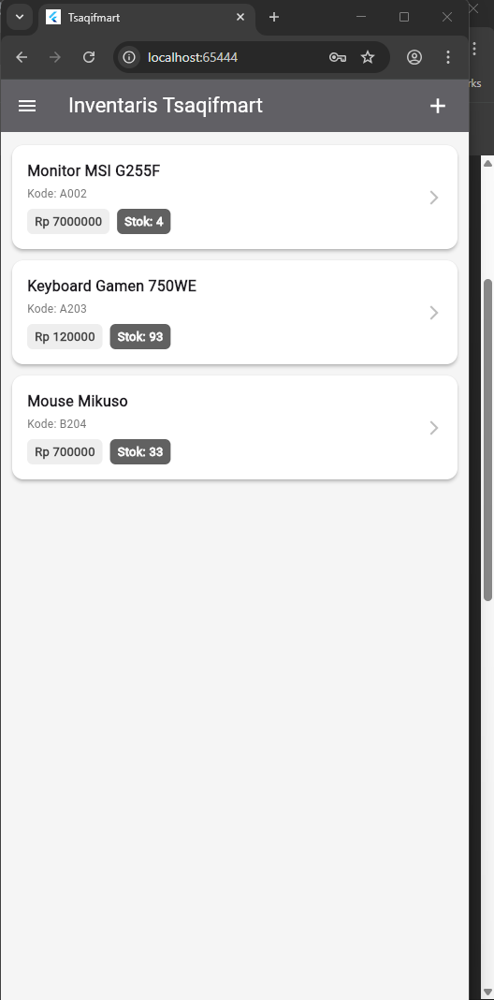
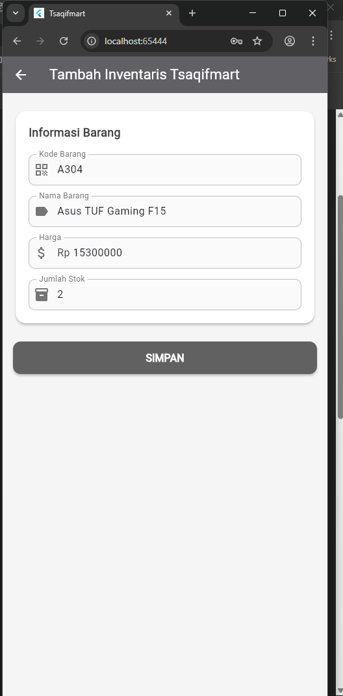
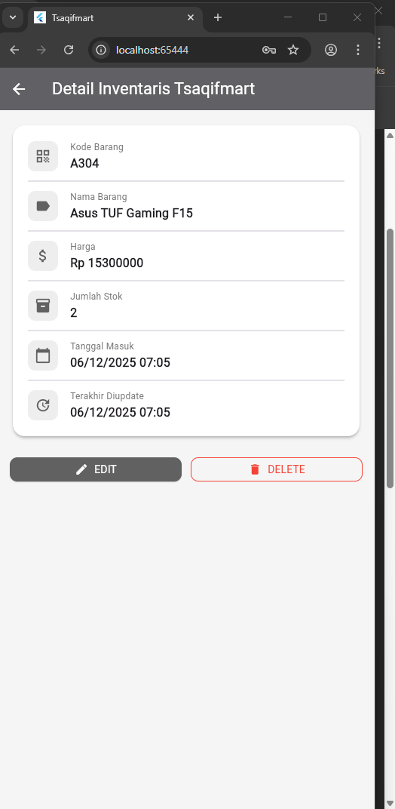
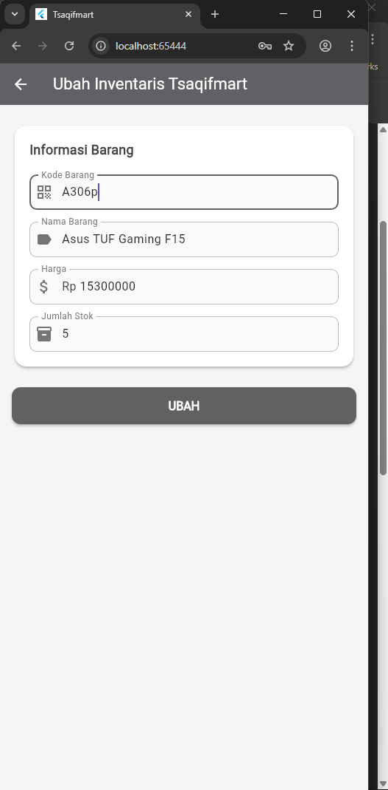
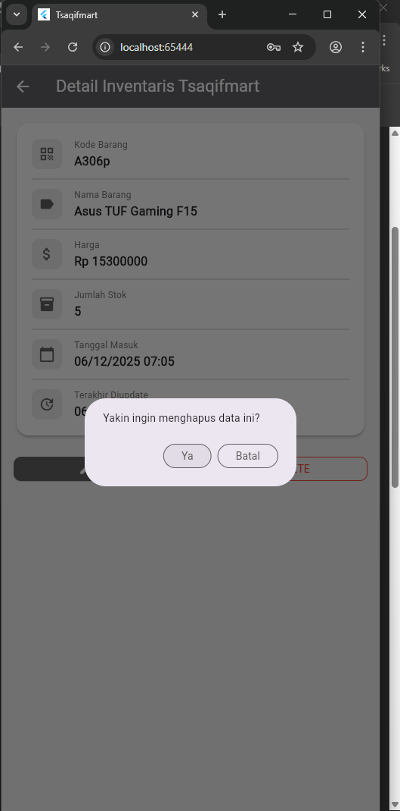

https://github.com/user-attachments/assets/c0bd2388-70ee-4626-82c1-87944f3af2a2

# Inventaris Barang Kategori Komputer Tsaqifmart

Aplikasi mobile manajemen inventaris barang yang dibangun menggunakan Flutter. Aplikasi ini menyediakan fitur CRUD (Create, Read, Update, Delete) untuk manajemen inventaris serta sistem autentikasi user. Aplikasi menggunakan tema warna abu-abu yang konsisten dan tampilan UI modern dengan Card, Badge, dan Icon.

## a. Registrasi

Halaman registrasi memungkinkan user baru untuk membuat akun. User mengisi form yang terdiri dari:

- **Nama Lengkap** - Minimal 3 karakter
- **Email** - Harus format email yang valid
- **Password** - Minimal 6 karakter
- **Konfirmasi Password** - Harus sama dengan password

Setelah form divalidasi, data dikirim ke server melalui `RegistrasiBloc.registrasi()`. Jika berhasil, muncul `SuccessDialog` dengan pesan "Registrasi berhasil, silahkan login". Jika gagal, muncul `WarningDialog` dengan pesan error.



## b. Login

Halaman login untuk autentikasi user yang sudah terdaftar. User memasukkan:

- **Email** - Email yang terdaftar
- **Password** - Password akun

Data login dikirim ke server melalui `LoginBloc.login()`. Jika response code 200 (berhasil), token autentikasi dan userID disimpan ke SharedPreferences melalui class `UserInfo`. Kemudian user diarahkan ke halaman List Inventaris menggunakan `Navigator.pushReplacement()`. Jika gagal, muncul `WarningDialog`.



## c. List Inventaris

Halaman utama yang menampilkan daftar seluruh barang inventaris dalam bentuk `ListView` dengan Card modern. Setiap item Card menampilkan:

- **Nama Barang** - Judul utama dengan font bold
- **Kode Barang** - Ditampilkan sebagai subtitle
- **Badge Harga** - Background abu-abu terang, format "Rp [harga]"
- **Badge Stok** - Background abu-abu gelap dengan teks putih, format "Stok: [jumlah]"

Data diambil dari server melalui `ProdukBloc.getProduks()` menggunakan `FutureBuilder`. User dapat tap pada item untuk melihat detail barang. Tombol (+) di AppBar untuk menambah barang baru. Menu drawer tersedia untuk logout.



## d. Tambah Inventaris

Form untuk menambahkan barang baru ke inventaris. User mengisi:

- **Kode Barang** - Kode unik untuk identifikasi barang
- **Nama Barang** - Nama produk/barang
- **Harga** - Harga barang dalam Rupiah (input angka)
- **Jumlah Stok** - Jumlah stok tersedia (input angka)

Saat tombol SIMPAN ditekan, data dikirim ke server melalui `ProdukBloc.addProduk()`. Field `created_at` dan `updated_at` otomatis terisi dengan timestamp saat ini menggunakan `DateTime.now().toIso8601String()`. Jika berhasil, user diarahkan kembali ke halaman List Inventaris.



## e. Detail Barang Inventaris

Halaman yang menampilkan informasi lengkap satu barang dalam Card dengan icon untuk setiap atribut:

- **Kode Barang** - Kode identifikasi barang
- **Nama Barang** - Nama produk
- **Harga** - Harga dalam format Rupiah
- **Jumlah Stok** - Stok yang tersedia
- **Tanggal Masuk** - Waktu barang ditambahkan (created_at), format DD/MM/YYYY HH:MM
- **Terakhir Diupdate** - Waktu update terakhir (updated_at), format DD/MM/YYYY HH:MM

Terdapat dua tombol aksi:

- **EDIT** - Membuka form untuk mengubah data barang
- **DELETE** - Menghapus barang dengan konfirmasi dialog



## f. Ubah Data Inventaris

Form edit yang strukturnya sama dengan form tambah. Perbedaannya:

- Judul berubah menjadi "Ubah Inventaris Tsaqifmart"
- Semua field terisi otomatis dengan data barang yang dipilih
- Tombol berubah menjadi "UBAH"

Saat disimpan melalui `ProdukBloc.updateProduk()`, field `updated_at` otomatis diperbarui dengan timestamp saat ini, sementara `created_at` tetap tidak berubah. Ini memungkinkan tracking kapan barang terakhir dimodifikasi.



## g. Hapus Barang Inventaris

Proses penghapusan barang dari inventaris dengan mekanisme konfirmasi:

1. User menekan tombol DELETE di halaman detail
2. Muncul `AlertDialog` dengan pesan "Yakin ingin menghapus data ini?"
3. Pilihan **Ya** - Menjalankan `ProdukBloc.deleteProduk()` untuk menghapus data dari server
4. Pilihan **Batal** - Menutup dialog tanpa menghapus

Jika penghapusan berhasil, user dikembalikan ke halaman List Inventaris. Jika gagal, muncul `WarningDialog` dengan pesan "Hapus gagal, silahkan coba lagi".



---

## Teknologi

| Teknologi             | Fungsi                                             |
| --------------------- | -------------------------------------------------- |
| **Flutter SDK**       | Framework untuk membangun UI cross-platform        |
| **Dart**              | Bahasa pemrograman utama Flutter                   |
| **HTTP Package**      | Komunikasi REST API dengan backend server          |
| **SharedPreferences** | Menyimpan token dan userID secara lokal            |
| **BLoC Pattern**      | Arsitektur untuk memisahkan business logic dari UI |

## Struktur Folder

```
lib/
├── bloc/           # Business logic (LoginBloc, RegistrasiBloc, ProdukBloc, LogoutBloc)
├── helpers/        # Helper classes (API, ApiUrl, UserInfo, AppException)
├── model/          # Data models (Login, Registrasi, Produk)
├── ui/             # Halaman UI (login, registrasi, produk_page, produk_form, produk_detail)
└── widget/         # Widget reusable (WarningDialog, SuccessDialog)
```

## Spesifikasi API (CodeIgniter 4)

Backend menggunakan **CodeIgniter 4** dengan RESTful API. Base URL: `http://localhost:8080`

### Endpoints

| Method   | Endpoint       | Fungsi                      | Request Body                                                                | Response                  |
| -------- | -------------- | --------------------------- | --------------------------------------------------------------------------- | ------------------------- |
| `POST`   | `/registrasi`  | Registrasi user baru        | `nama`, `email`, `password`                                                 | `status`, `message`       |
| `POST`   | `/login`       | Login user                  | `email`, `password`                                                         | `code`, `token`, `userID` |
| `GET`    | `/produk`      | Mengambil semua data barang | -                                                                           | Array of `Produk`         |
| `POST`   | `/produk`      | Menambah barang baru        | `kode_produk`, `nama_produk`, `harga`, `jumlah`, `created_at`, `updated_at` | `status`                  |
| `GET`    | `/produk/{id}` | Mengambil detail barang     | -                                                                           | Object `Produk`           |
| `PUT`    | `/produk/{id}` | Mengubah data barang        | `kode_produk`, `nama_produk`, `harga`, `jumlah`, `updated_at`               | `status`                  |
| `DELETE` | `/produk/{id}` | Menghapus barang            | -                                                                           | `data` (boolean)          |

### Struktur Response

**Login Response:**

```json
{
  "code": 200,
  "token": "eyJhbGciOiJIUzI1NiIsInR5cCI6...",
  "userID": "1"
}
```

**Produk Response:**

```json
{
  "id": "1",
  "kode_produk": "KMP001",
  "nama_produk": "Laptop ASUS",
  "harga": 12000000,
  "jumlah": 10,
  "created_at": "2025-12-06T10:30:00",
  "updated_at": "2025-12-06T14:45:00"
}
```

### Struktur Database (MySQL)

**Tabel: produk**
| Field | Type | Keterangan |
|-------|------|------------|
| `id` | INT (Primary Key, Auto Increment) | ID unik barang |
| `kode_produk` | VARCHAR(50) | Kode identifikasi barang |
| `nama_produk` | VARCHAR(255) | Nama barang |
| `harga` | INT | Harga barang |
| `jumlah` | INT | Jumlah stok |
| `created_at` | DATETIME | Waktu data dibuat |
| `updated_at` | DATETIME | Waktu data terakhir diupdate |

**Tabel: user**
| Field | Type | Keterangan |
|-------|------|------------|
| `id` | INT (Primary Key, Auto Increment) | ID unik user |
| `nama` | VARCHAR(100) | Nama lengkap user |
| `email` | VARCHAR(100) | Email user (unique) |
| `password` | VARCHAR(255) | Password ter-hash |

## Author

**Tsaqif Hasbi Aghna Syarief** - H1D023059
Shift I --> Shift A
